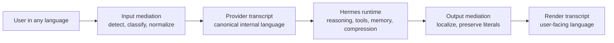

# unilang

**Research-led language mediation runtime for Hermes Agent**

Canonical internal reasoning. Native user-facing language.

Designing multilingual agent systems as a runtime problem, not a prompt trick.

[Portuguese (Brazil)](README.pt-BR.md)

---

## Overview

`unilang` is the implementation track for **LMR: Language Mediation Runtime**, a runtime layer designed for Hermes Agent.

It allows users to interact with Hermes in their natural language while keeping the internal runtime aligned around a **canonical provider language**.

Instead of treating translation as a prompt hack, a one-off tool, or a translator sub-agent, `unilang` treats multilingual interaction as a **first-class runtime concern**.

The project is built around a simple but consequential idea:

> A multilingual user experience does not require a multilingual internal state.

For an agent runtime, those are different concerns.

## The Core Idea

Every important interaction can exist in up to three forms:

| Variant | Purpose | Example |
|---|---|---|
| `raw` | Original user text for audit and replay | Portuguese user message |
| `provider` | Canonical internal content used for reasoning and future turns | English normalized transcript |
| `render` | User-facing localized output | Portuguese assistant response |

This gives Hermes a stable internal language without forcing the human experience into English.

## Why This Exists

Multilingual chat alone is not enough for a serious agent runtime.

Mixed-language internal state causes drift in:

- reasoning consistency;
- memory writes;
- compression summaries;
- delegated child tasks;
- future retrieval and knowledge workflows.

`unilang` is designed to solve that by separating **machine-facing transcript state** from **human-facing output state**.

## Why Language Policy Matters

There is already enough research signal to justify treating language choice as an engineering variable rather than a cosmetic preference.

### 1. Prompt language affects model behavior

- Etxaniz et al. show that **self-translation into English consistently outperforms direct inference in non-English languages** across five tasks, suggesting multilingual models often fail to use their full capability when prompted directly in non-English inputs.[1]
- Kmainasi et al. report that across **197 experiments on Arabic tasks**, non-native English prompting performed best on average, followed by mixed prompts, then native prompts.[2]
- Enomoto et al. show the picture is more nuanced: once **translationese bias** is removed, the advantage of English instructions is **real but not overwhelming**.[3]

The practical takeaway is not "English always wins." It is that **prompt language measurably changes outcomes**, and the effect is task-dependent.

### 2. Cross-lingual reasoning strategies can improve results

- Huang et al. introduce cross-lingual-thought prompting and show it can **improve multilingual task performance and reduce the gap across languages**, including **10+ average point gains** on arithmetic reasoning and open-domain QA in their setup.[4]

That matters because `unilang` is not merely about translation. It is about imposing a more stable internal reasoning path when the runtime needs consistency.

### 3. Tokenization is not language-neutral

- Petrov et al. show that the **same content can tokenize up to 15x longer** depending on language, with direct implications for **cost, latency, and usable context length**.[5]
- Maksymenko and Turuta further show that low-resource languages can become **slower and more expensive** to process when the tokenizer underrepresents them, and that tokenization efficiency also varies by domain and morphology.[6]

For agent systems, this is not a billing footnote. It affects context pressure, compression frequency, retrieval budget, and the cost of every tool-augmented turn.

### 4. Multilingual capability tracks training imbalance

- MEGA, a large multilingual evaluation of generative AI across **70 languages**, highlights persistent challenges for low-resource languages.[7]
- Language Ranker shows a **strong correlation between language performance and the proportion of that language in pretraining corpora**.[8]

This means multilingual runtime behavior is not just a UX issue. It inherits the asymmetries of data, tokenization, and model training.

## What unilang Is Claiming

`unilang` is **not** built on the claim that English is universally superior.

It is built on the narrower and more defensible claim that:

1. language choice influences quality;
2. language choice influences token cost and latency;
3. mixed internal state creates avoidable runtime instability;
4. a canonical internal transcript is a testable way to reduce that instability.

## Working Hypothesis

The operating hypothesis of `unilang` is:

| Dimension | Hypothesis |
|---|---|
| Reasoning quality | A canonical internal provider language can improve consistency on multilingual tasks that involve planning, tool use, or long-turn state |
| Cost | A stable provider transcript can reduce unnecessary token expansion and repeated multilingual drift |
| Memory | Canonical transcript variants will make memory writes and summaries less linguistically noisy |
| Compression | Compression quality should improve when summarization happens over one internal language policy instead of mixed-language history |
| Delegation | Child-task payloads should become cleaner when the internal protocol is canonicalized |
| UX | The user should still receive output in their own language, with literals preserved |

We are deliberately treating this as a **runtime hypothesis to be measured**, not as a branding statement to be assumed.

## What unilang Is Building

- canonical provider transcript management;
- localized render transcript delivery;
- input normalization for new user turns;
- selective mediation of text-heavy tool outputs;
- post-loop response localization;
- variant persistence for reuse and auditability;
- privacy-aware translation routing;
- compatibility with memory, compression, delegation, and gateway surfaces.

## What Success Looks Like

`unilang` is worth building only if it can improve multilingual agent operation without corrupting literal content or breaking core runtime invariants.

We care about outcomes such as:

- better task completion consistency across user languages;
- lower mixed-language drift in internal transcript state;
- lower or more stable token usage per resolved task;
- better compression and memory hygiene;
- strong literal preservation for code, logs, commands, paths, and structured payloads.

## Runtime Model

## Why a Canonical Provider Language

In a normal chat application, multilingual state is mostly a presentation problem.

In an agent runtime, it is also a systems problem because language choice touches:

- tool selection and interpretation;
- memory flushes;
- context compression;
- retrieval summaries;
- delegated task payloads;
- token budget efficiency;
- auditability and replay.

`unilang` makes those concerns explicit.

## Architectural Principles

1. Stable prompt prefixes must remain stable.
2. Frozen prompt artifacts should be normalized once, not retranslated every turn.
3. Literal artifacts must be preserved.
4. Canonical internal state should be authoritative for machine use.
5. Human-facing output should remain natural in the user's language.
6. Privacy boundaries must not regress when translation is introduced.

## Non-Goals

`unilang` is not trying to:

- prove that one language is always best for every task;
- replace native multilingual capability inside foundation models;
- fully localize every tool schema, CLI surface, or provider interface on day one;
- stream perfect simultaneous interpretation token by token;
- trade literal correctness for fluency.

## What Must Never Be Mangled

By design, `unilang` preserves literal content such as:

- code fences;
- shell commands;
- file paths;
- URLs;
- environment variables;
- structured payloads like JSON, YAML, and XML;
- stack traces and terminal output;
- identifiers, package names, and tool arguments.

If this guarantee fails, the runtime fails.

## Planned System Areas

| Area | Responsibility |
|---|---|
| `LanguageRuntime` | Orchestrates mediation decisions and flow |
| `LanguagePolicyEngine` | Controls thresholds, routing, privacy, and fallbacks |
| `LanguageDetector` | Detects source language with confidence |
| `ContentClassifier` | Distinguishes prose from code, logs, and structured content |
| `TranslationAdapter` | Uses Hermes auxiliary runtime for deterministic transforms |
| `VariantStore` | Persists raw, provider, and render variants |
| `LanguageCache` | Reuses transform outputs by content and policy hash |

## Target Hermes Integration Surfaces

`unilang` is being designed around real Hermes runtime seams, especially:

- `run_agent.py`;
- prompt assembly;
- session persistence;
- memory and compression;
- delegation;
- gateway delivery;
- runtime-provider resolution.

The implementation is intentionally aligned with Hermes internals rather than bolted on as a tool.

## Measurement Plan

Because the core claim is empirical, `unilang` should eventually be evaluated on at least these axes:

| Axis | Example question |
|---|---|
| Task quality | Does PT-BR input with canonical EN provider reasoning outperform or match direct PT-BR end-to-end prompting? |
| Token efficiency | How many tokens are saved or added by normalization, localization, and variant reuse? |
| Compression quality | Are compressed summaries more stable and reusable when built from provider variants? |
| Memory quality | Do canonical-language memory writes reduce drift and ambiguity? |
| Delegation quality | Do child tasks succeed more reliably with canonical payloads? |
| Literal safety | Are commands, paths, JSON, logs, and code preserved exactly? |
| Latency | Is mediation overhead small enough for conversational use? |

The project is therefore both an implementation effort and a measurement effort.

## Roadmap Snapshot

1. Establish the Hermes host integration baseline.
2. Land core input/output mediation.
3. Add provider/render/raw variant persistence.
4. Normalize frozen prompt artifacts safely.
5. Mediate natural-language-heavy tool results selectively.
6. Move compression and memory flows onto canonical transcript variants.
7. Extend the model to delegation and gateway surfaces.
8. Harden, benchmark, document, and upstream.

## Current Status

| Track | Status |
|---|---|
| Public repository | Live |
| Project positioning | Defined |
| Host integration mapping | In progress |
| Runtime implementation | Starting |
| Remote isolated validation environment | Ready |

## Positioning

`unilang` sits at the intersection of:

- multilingual prompting research;
- tokenizer fairness and token-efficiency concerns;
- agent runtime architecture;
- memory, compression, and delegation design.

It is not just a multilingual wrapper.

It is an attempt to make multilingual agent systems **operationally coherent**.

## Development Workflow

The working model is intentionally split:

- code is authored locally;
- the Hermes host is integrated in a separate checkout;
- isolated execution and debugging happen in a dedicated remote Docker environment.

This keeps the public project clean while still allowing real Hermes validation during implementation.

## Public Repository Policy

This public repository intentionally excludes internal planning artifacts and private working notes.

That means directories such as `.planning/`, internal `docs/`, and local architecture scratch material are kept out of version control here. The public repository is reserved for the project-facing implementation surface.

## Research Signals Behind the Design

The design of `unilang` is informed by a growing body of multilingual LLM research pointing to the same conclusion from different angles:

- language is a performance variable, not just a presentation layer;[1][2][3]
- internal reasoning paths can benefit from cross-lingual mediation;[4]
- tokenization asymmetry can materially distort cost, latency, and context budget;[5][6]
- low-resource language performance is still structurally uneven.[7][8]

That does not prove `unilang` in advance.

It does mean the problem is real enough to justify building the runtime carefully and measuring it rigorously.

## Selected Literature

1. [Etxaniz et al., 2024, NAACL: *Do Multilingual Language Models Think Better in English?*](https://aclanthology.org/2024.naacl-short.46/)  
   Self-translate consistently outperforms direct inference across five tasks.

2. [Kmainasi et al., 2024: *Native vs Non-Native Language Prompting: A Comparative Analysis*](https://arxiv.org/abs/2409.07054)  
   Across 197 Arabic-task experiments, non-native English prompting performed best on average.

3. [Enomoto et al., 2025, NAACL: *A Fair Comparison without Translationese: English vs. Target-language Instructions for Multilingual LLMs*](https://aclanthology.org/2025.naacl-short.55/)  
   Prompt-language effects remain, but the English advantage is not overwhelming once translationese bias is controlled.

4. [Huang et al., 2023, EMNLP Findings: *Not All Languages Are Created Equal in LLMs*](https://aclanthology.org/2023.findings-emnlp.826/)  
   Cross-lingual-thought prompting improves multilingual reasoning and reduces language gaps.

5. [Petrov et al., 2023, NeurIPS: *Language Model Tokenizers Introduce Unfairness Between Languages*](https://arxiv.org/abs/2305.15425)  
   Equivalent content can tokenize radically differently across languages, with direct cost, latency, and context implications.

6. [Maksymenko and Turuta, 2025, Frontiers: *Tokenization Efficiency of Current Foundational Large Language Models for the Ukrainian Language*](https://www.frontiersin.org/journals/artificial-intelligence/articles/10.3389/frai.2025.1538165/full)  
   Underrepresented languages can become materially slower and more expensive to process, and tokenization efficiency varies by domain and morphology.

7. [Ahuja et al., 2023, EMNLP: *MEGA: Multilingual Evaluation of Generative AI*](https://arxiv.org/abs/2303.12528)  
   Large multilingual evaluation showing persistent challenges for low-resource languages.

8. [Li et al., 2024/2025, AAAI: *Language Ranker*](https://arxiv.org/abs/2404.11553)  
   Shows a strong correlation between performance across languages and their share in pretraining corpora.

9. [Ghosh et al., 2025, EMNLP Findings: *A Survey of Multilingual Reasoning in Language Models*](https://arxiv.org/abs/2502.09457)  
   A useful overview of multilingual reasoning challenges, methods, and open research gaps.

## Status Direction

This is an active build, not an abandoned concept repo.

The current stage is about turning this research-backed architecture into a clean public implementation track, then wiring it into Hermes in a way that preserves cache stability, privacy guarantees, literal correctness, and runtime observability.

---

## Summary

`unilang` is building a serious multilingual runtime model for Hermes Agent.

Not full-history translation. Not a translator tool. Not a surface-level prompt trick.

A canonical internal transcript, a localized human transcript, and a runtime designed to keep both clean.

The bet is not that language stops mattering.

The bet is that once we make language policy explicit, measurable, and runtime-native, multilingual agent systems become more stable, more auditable, and more efficient to operate.
