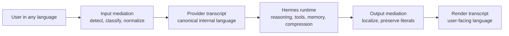

# unilang

**Language mediation infrastructure for Hermes Agent**

Canonical internal reasoning. Native user-facing language.

[Portuguese (Brazil)](README.pt-BR.md)

---

## Overview

`unilang` is the implementation track for **LMR: Language Mediation Runtime**, a runtime layer designed for Hermes Agent.

It allows users to interact with Hermes in their natural language while keeping the internal runtime aligned around a **canonical provider language**.

Instead of treating translation as a prompt hack or an auxiliary agent, `unilang` models multilingual interaction as a first-class runtime concern.

## The Core Idea

Every important interaction can exist in up to three forms:

| Variant | Purpose | Example |
|---|---|---|
| `raw` | Original user text for audit and replay | Portuguese user message |
| `provider` | Canonical internal content used for reasoning and future turns | English normalized transcript |
| `render` | User-facing localized output | Portuguese assistant response |

This gives Hermes a stable internal language without forcing the human experience into English.

## Why This Exists

Multilingual chat alone is not enough for a serious agent runtime.

Mixed-language internal state causes drift in:

- reasoning consistency;
- memory writes;
- compression summaries;
- delegated child tasks;
- future retrieval and knowledge workflows.

`unilang` is designed to solve that by separating **machine-facing transcript state** from **human-facing output state**.

## What unilang Is Building

- canonical provider transcript management;
- localized render transcript delivery;
- input normalization for new user turns;
- selective mediation of text-heavy tool outputs;
- post-loop response localization;
- variant persistence for reuse and auditability;
- privacy-aware translation routing;
- compatibility with memory, compression, delegation, and gateway surfaces.

## Runtime Model

## Architectural Principles

1. Stable prompt prefixes must remain stable.
2. Frozen prompt artifacts should be normalized once, not retranslated every turn.
3. Literal artifacts must be preserved.
4. Canonical internal state should be authoritative for machine use.
5. Human-facing output should remain natural in the user's language.
6. Privacy boundaries must not regress when translation is introduced.

## What Must Never Be Mangled

By design, `unilang` preserves literal content such as:

- code fences;
- shell commands;
- file paths;
- URLs;
- environment variables;
- structured payloads like JSON, YAML, and XML;
- stack traces and terminal output;
- identifiers, package names, and tool arguments.

## Planned System Areas

| Area | Responsibility |
|---|---|
| `LanguageRuntime` | Orchestrates mediation decisions and flow |
| `LanguagePolicyEngine` | Controls thresholds, routing, privacy, and fallbacks |
| `LanguageDetector` | Detects source language with confidence |
| `ContentClassifier` | Distinguishes prose from code, logs, and structured content |
| `TranslationAdapter` | Uses Hermes auxiliary runtime for deterministic transforms |
| `VariantStore` | Persists raw, provider, and render variants |
| `LanguageCache` | Reuses transform outputs by content and policy hash |

## Target Hermes Integration Surfaces

`unilang` is being designed around real Hermes runtime seams, especially:

- `run_agent.py`;
- prompt assembly;
- session persistence;
- memory and compression;
- delegation;
- gateway delivery;
- runtime-provider resolution.

The implementation is intentionally aligned with Hermes internals rather than bolted on as a tool.

## Roadmap Snapshot

1. Establish the Hermes host integration baseline.
2. Land core input/output mediation.
3. Add provider/render/raw variant persistence.
4. Normalize frozen prompt artifacts safely.
5. Mediate natural-language-heavy tool results selectively.
6. Move compression and memory flows onto canonical transcript variants.
7. Extend the model to delegation and gateway surfaces.
8. Harden, benchmark, document, and upstream.

## Current Status

| Track | Status |
|---|---|
| Public repository | Live |
| Project positioning | Defined |
| Host integration mapping | In progress |
| Runtime implementation | Starting |
| Remote isolated validation environment | Ready |

## Development Workflow

The working model is intentionally split:

- code is authored locally;
- the Hermes host is integrated in a separate checkout;
- isolated execution and debugging happen in a dedicated remote Docker environment.

This keeps the public project clean while still allowing real Hermes validation during implementation.

## Public Repository Policy

This public repository intentionally excludes internal planning artifacts and private working notes.

That means directories such as `.planning/`, internal `docs/`, and local architecture scratch material are kept out of version control here. The public repository is reserved for the project-facing implementation surface.

## Status Direction

This is an active build, not an abandoned concept repo.

The current stage is about turning the architecture into a clean public implementation track, then wiring the runtime into Hermes in a way that preserves cache stability, privacy guarantees, and literal correctness.

---

## Summary

`unilang` is building a serious multilingual runtime model for Hermes Agent.

Not full-history translation. Not a translator tool. Not a surface-level prompt trick.

A canonical internal transcript, a localized human transcript, and a runtime designed to keep both clean.
