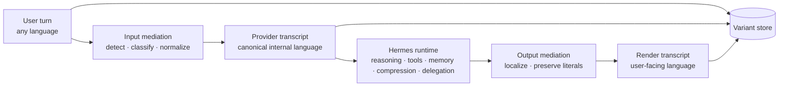

<div align="center">

# unilang

**English** · [Português (Brasil)](README.pt-BR.md)

**Canonical internal language. Native multilingual UX.**

**A language mediation runtime for Hermes Agent that treats multilinguality as a systems problem — not a prompt trick.**

[](#current-status)
[](#how-it-fits-hermes)
[](#the-runtime-model)
[](#design-goals)
[](#what-the-user-experiences)
[](#what-must-never-be-mangled)

<br>

```text
raw → provider → Hermes runtime → render
```

**Users should speak naturally.**  
**The runtime should stay linguistically coherent.**

<br>

> *A multilingual user experience does not require a multilingual internal state.*

<br>

[Why This Exists](#why-this-exists) · [Runtime Model](#the-runtime-model) · [How It Fits Hermes](#how-it-fits-hermes) · [Current Status](#current-status) · [Roadmap](#implementation-roadmap)

</div>

---

> [!IMPORTANT]
> `unilang` is **not** “translate everything into English and hope for the best.”
>
> It is a design and implementation track for a **language mediation runtime**: a runtime layer that lets users talk to Hermes in their native language while the agent maintains a **stable canonical internal language policy** for reasoning, summaries, memory, delegation, and tool-heavy execution.

---

## Why This Exists

Most multilingual AI products stop at surface fluency.

That is enough for a chatbot. It is **not** enough for an agent runtime.

Hermes is not just generating replies. It assembles prompts, resolves providers, persists sessions, compresses context, routes through gateway surfaces, and runs tool-heavy workflows across long-lived state. Those are real system boundaries in the official Hermes architecture and developer docs. citeturn422277search2turn422277search1turn422277search0turn422277search6turn422277search7turn422277search5

Once an agent accumulates state, **language becomes infrastructure**.

If every user turn, memory write, delegated payload, compression summary, and tool result drifts between languages, the runtime inherits avoidable instability:

- memory drift;
- weaker retrieval semantics;
- inconsistent summaries;
- noisy delegated tasks;
- unnecessary token expansion;
- literal corruption around code, logs, flags, paths, and structured payloads.

`unilang` exists to make language policy **explicit, testable, inspectable, and runtime-native**.

---

## The Thesis

A serious agent should separate:

1. **the language the human prefers to use**, from
2. **the language the runtime prefers to preserve internally**.

That separation creates a simple but powerful operating model:

- people interact in their own language;
- the runtime reasons over a canonical provider-facing transcript;
- the original message remains available for audit and literal recovery;
- outputs are rendered back in the user’s language without poisoning internal state.

This repo explores that model end-to-end for Hermes.

---

## The Runtime Model

Every important turn can exist in up to three variants:

| Variant | Purpose | Example |
|---|---|---|
| `raw` | original user text preserved exactly | `me explica esse erro e arruma meu docker compose` |
| `provider` | canonical machine-facing form used by runtime flows | `Explain this error and fix my docker compose setup.` |
| `render` | user-facing localized response | `Claro — vou te explicar o erro e ajustar seu docker-compose.` |

That gives the system three things at once:

- native UX;
- coherent runtime state;
- replayable provenance.



---

## What the User Experiences

From the user side, `unilang` should feel almost invisible.

The user gets:

- natural input in Portuguese, Japanese, Arabic, Spanish, mixed language, or whatever they actually use;
- natural output in the same language;
- protection against awkward translationese around technical content;
- preservation of code, stack traces, configs, JSON, commands, and file paths;
- consistent behavior across longer sessions.

The point is **not** to make the user adapt to the runtime.

The point is to let the runtime do the adapting without becoming linguistically chaotic.

---

## What Must Never Be Mangled

> [!CAUTION]
> If `unilang` ever mutates machine-critical literals, the runtime has failed.

These classes of content must be preserved exactly when policy requires:

- code fences and code blocks;
- shell commands and CLI flags;
- file paths and URLs;
- environment variables and secret placeholders;
- JSON, YAML, XML, SQL, regex, and config fragments;
- stack traces, logs, and terminal output;
- package names, symbols, identifiers, and function names;
- diff hunks and structured tool payloads.

Fluency is optional. Literal integrity is not.

---

## Design Goals

### 1. Canonical machine-facing state
The runtime should have a stable internal language policy for reasoning, memory, compression, delegation, and retrieval-facing representations.

### 2. Native human-facing output
Users should still receive answers in their own language, naturally.

### 3. Literal safety
Machine-critical text survives mediation untouched.

### 4. Selective mediation
Not every byte should be translated. Policy must be content-aware.

### 5. Variant persistence
`raw`, `provider`, and `render` variants should be reusable for audit, replay, caching, and future evaluation.

### 6. Observability
Language mediation should be measurable, debuggable, and benchmarkable.

### 7. Upstream realism
This should fit Hermes as it exists, not as an imaginary greenfield system.

---

## How It Fits Hermes

`unilang` is being shaped against Hermes’ real architectural seams.

The official Hermes docs explicitly surface prompt assembly, provider runtime resolution, session storage, context compression, gateway internals, and agent-loop internals as first-class implementation surfaces. That is exactly where language policy matters most. citeturn422277search2turn422277search1turn422277search0turn422277search4turn422277search5turn422277search6turn422277search7

| Hermes surface | Why it matters for `unilang` |
|---|---|
| Prompt assembly | canonical provider transcript must preserve prompt cache stability and avoid poisoning persistent state |
| Provider runtime resolution | mediation policy has to coexist with how Hermes selects providers and API modes |
| Agent loop | turn lifecycle is the natural interception point for input/output mediation |
| Session storage | variant persistence and replay depend on where transcript state is stored |
| Context compression | coherent provider-language summaries are easier to compare and reuse |
| Gateway internals | localization belongs at delivery edges without contaminating internal state |
| Delegation | child tasks should inherit stable machine-facing payloads |
| Memory pipeline | canonicalized memory writes can reduce multilingual drift |

---

## What This Repo Is

Today, this repo reads as a **serious design-and-integration track** rather than a finished packaged runtime.

That is a strength, not a weakness.

It means the project is already organized around implementation phases instead of vague ideas.

### Current repo shape

| Area | Role |
|---|---|
| `.planning/research/` | architecture notes, host verification, integration strategy |
| `.planning/phases/` | phased implementation docs |
| `.planning/plans/` | execution planning for host integration |

### Current phase map

| Phase | Focus |
|---|---|
| 00 | Host integration |
| 01 | Core runtime |
| 02 | Variants and storage |
| 03 | Prompt artifacts |
| 04 | Tool results |
| 05 | Memory and compression |
| 06 | Delegation and gateways |
| 07 | Polish and upstreaming |

That is the right shape for a project whose hardest problem is architectural correctness.

---

## Current Status

> [!NOTE]
> `unilang` should currently be read as a **high-conviction implementation roadmap backed by real Hermes seams**.
>
> The project is already structured like a system that intends to ship — but the README should reflect that honestly rather than pretending it is already a turnkey product.

So the right framing is:

- not “experimental prompt hack”;  
- not “universal translator plugin”;  
- not “finished SDK with polished install story”;  
- but **an upstream-quality runtime architecture track with clear implementation boundaries**.

---

## Why This Approach Is Strong

Because it attacks the real failure mode.

Most multilingual agent setups treat language as a surface concern.

`unilang` treats language as a **state-management concern**.

That changes everything:

- summaries become comparable across sessions;
- memory becomes less language-fragmented;
- delegated tasks inherit cleaner payloads;
- provider-facing reasoning stays coherent;
- user-facing language remains native;
- evaluation becomes possible at the runtime-policy layer.

This is the difference between “the model speaks many languages” and “the system has a language architecture.”

---

## Non-Goals

`unilang` is **not** trying to be:

- a generic chatbot translator;
- a blind “everything into English” pipeline;
- a replacement for multilingual model capability;
- a justification to rewrite entire histories unnecessarily;
- a layer that sacrifices literal correctness for stylistic smoothness;
- a claim that one language is universally superior in every context.

This is about **runtime discipline**, not language ideology.

---

## Implementation Roadmap

### Phase 00 — Host integration
Find the right interception seams inside Hermes.

### Phase 01 — Core runtime
Establish the mediation contract and canonical flow.

### Phase 02 — Variants and storage
Persist `raw`, `provider`, and `render` cleanly.

### Phase 03 — Prompt artifacts
Protect prompt stability, cacheability, and canonical prompt assembly.

### Phase 04 — Tool results
Introduce selective mediation for tool-heavy outputs without corrupting literals.

### Phase 05 — Memory and compression
Make summaries and memory writes canonical, inspectable, and evaluable.

### Phase 06 — Delegation and gateways
Push policy through child tasks and gateway delivery surfaces.

### Phase 07 — Polish and upstreaming
Harden, document, benchmark, and prepare the work for serious upstream discussion.

---

## Success Criteria

`unilang` is successful if it can demonstrate, with real Hermes flows, that:

- users retain native-language interaction;
- provider-facing state remains stable and coherent;
- literal artifacts are preserved correctly;
- memory and compression quality improve or become more consistent;
- delegation inherits cleaner payloads;
- the system remains observable enough to debug failures instead of guessing.

If those conditions are not met, the project is decoration, not architecture.

---

## What a Great Future README Could Eventually Add

Once implementation matures, this README can grow into:

- concrete install instructions;
- architecture diagrams tied to code paths;
- benchmark results;
- before/after examples for compression and memory quality;
- literal preservation test suites;
- integration examples against live Hermes seams;
- an upstream contribution path.

That future README should feel inevitable.

This one is designed to make the project feel **serious enough to deserve it**.

---

## A Final Line

<div align="center">

**Multilingual UX is easy to demo.**  
**Multilingual runtime coherence is the real problem.**

**`unilang` exists for the second one.**

</div>
