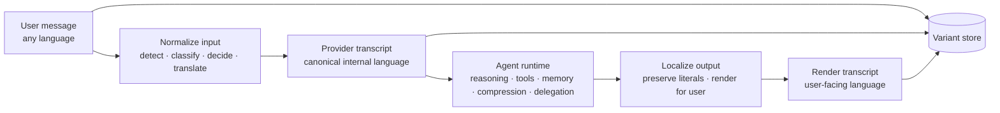

<div align="center">

# unilang

**English** · [Português (Brasil)](README_pt-BR.md)

**Canonical internal language. Native multilingual UX.**

Language mediation runtime primitives for multilingual agent systems, designed around a simple rule:

**humans speak naturally, the runtime stays coherent.**

[](#installation)
[](#current-status)
[](#hermes-integration)
[](#architecture)
[](#safety-invariants)

```text
raw -> provider -> agent runtime -> render
```

[Overview](#overview) · [Current Status](#current-status) · [Architecture](#architecture) · [Benchmarks](#benchmarks) · [Installation](#installation) · [Hermes Integration](#hermes-integration)

</div>

---

## Overview

`unilang` is a **language mediation runtime**.

It lets a user interact in their own language while the agent runtime keeps a stable **provider-language transcript** for model calls, summaries, memory, delegation, and tool-heavy flows.

This is not a prompt trick and not a generic "translate everything" layer. It is a runtime policy that separates three concerns:

| Variant | Purpose |
|---|---|
| `raw` | original user text preserved exactly |
| `provider` | canonical machine-facing text used internally |
| `render` | localized human-facing output |

That separation gives the system three properties at once:

- native multilingual UX;
- stable machine-facing state;
- auditable provenance for replay and debugging.

---

## Why It Exists

Multilinguality is easy at the chat surface and hard in the runtime.

Once an agent starts accumulating state, language becomes infrastructure:

- memory writes drift;
- summaries become inconsistent;
- delegated tasks get noisy;
- retrieval semantics fragment;
- code and machine literals risk being mangled.

`unilang` exists to make language policy explicit, testable, and reusable across those boundaries.

---

## Current Status

`unilang` is currently an **active prototype with working runtime primitives and Hermes-side integration**.

What is implemented today:

- `LanguageRuntime` orchestration for input normalization, output localization, tool-result mediation, prompt artifacts, compression, memory, delegation, and gateway delivery;
- SQLite-backed `LanguageCache` for transform reuse;
- SQLite-backed `VariantStore` for `raw` / `provider` / `render` persistence;
- `PassthroughTranslationAdapter` for deterministic local tests;
- `MiniMaxTranslationAdapter` for live translation via MiniMax's Anthropic-compatible API;
- Hermes-side `UnilangMediator` integration in the agent loop;
- regression coverage for runtime behavior and mediator integration.

What is still prototype-level:

- language detection is heuristic, not a full language ID model;
- live translation quality depends on the configured external model;
- streaming localization is not implemented;
- this repository is centered on the runtime layer, not a polished end-user product surface.

---

## Tested Surface

The current tested surface includes:

- user-turn normalization;
- assistant output localization;
- literal preservation for code fences and inline literals;
- selective tool-result mediation;
- cache reuse and cache-version behavior;
- prompt-artifact preparation and freeze-once behavior;
- compression and memory payload shaping;
- delegation payload shaping and child-context inheritance;
- gateway message preparation;
- Hermes-side mediator wiring and session-bound usage.

Local regression status at the time of this update:

```text
unilang tests: 69 passed
hermes-agent unilang mediator tests: 3 passed
```

---

## Benchmarks

Two benchmark tracks are in use.

### 1. Deterministic local runtime benchmark

File:

- `benchmark_runtime.py`

Purpose:

- measure runtime overhead without network variance;
- compare cold vs warm paths;
- validate cache behavior.

What it covers:

- `normalize_user_message()`
- `localize_assistant_output()`
- `prepare_prompt_artifacts()`
- `mediate_tool_result()`

Existing local snapshot from `docs/BENCHMARKS.md`:

- prompt-artifact warm path drops to ~`2 ms`;
- cache hits are present and store failures are `0`;
- tool-result mediation is the most expensive deterministic path, as expected.

### 2. Live MiniMax end-to-end benchmark

Files:

- `scripts/benchmarks/benchmark_quick.py`
- `scripts/benchmarks/benchmark_e2e_minimax.py`
- `scripts/benchmarks/benchmark_e2e_minimax_controlled.py`

The controlled 18-language benchmark was executed on VPS with MiniMax and produced:

```text
Detection:    18/18
Normalization: 17/18
Localization:  17/18
Tool Med:      18/18
```

Observed live behavior:

- detection covered all benchmark languages in the controlled run;
- normalization and localization worked for all non-English benchmark cases except the expected English no-op path;
- tool mediation preserved machine-critical content while remaining effectively negligible compared with live translation latency;
- live translation latency varied by language and network conditions, typically from low single-digit seconds up to ~11.5 seconds for a localization step.

Representative results from the controlled VPS run:

```text
Spanish:    det=Y(es)  norm=Y 5753ms  loc=Y 2927ms  tool=Y 17ms
Portuguese: det=Y(pt-BR) norm=Y 1898ms loc=Y 6967ms tool=Y 14ms
German:     det=Y(de)  norm=Y 1695ms  loc=Y 11555ms tool=Y 8ms
Japanese:   det=Y(ja)  norm=Y 2443ms  loc=Y 11018ms tool=Y 7ms
Hebrew:     det=Y(he)  norm=Y 2310ms  loc=Y 7513ms tool=Y 8ms
```

---

## Architecture

At a high level, `unilang` inserts a mediation layer around the agent runtime.



### Core runtime components

| Component | Responsibility |
|---|---|
| `LanguageRuntime` | orchestration across all mediation paths |
| `LanguageDetector` | heuristic per-message language detection |
| `ContentClassifier` | distinguishes prose, code, terminal, structured, mixed |
| `LanguagePolicyEngine` | decides whether and how to transform |
| `BaseTranslationAdapter` | translation/localization contract |
| `PassthroughTranslationAdapter` | deterministic no-op adapter for tests |
| `MiniMaxTranslationAdapter` | live MiniMax-backed translation adapter |
| `LanguageCache` | transform cache keyed by content and policy/model metadata |
| `VariantStore` | persistence for `raw`, `provider`, and `render` variants |
| `PromptArtifactScanner` | gating/scanning of prompt artifacts before preparation |

### Runtime flow

#### Input normalization

`normalize_user_message()`:

1. detects the input language;
2. classifies content kind;
3. decides whether normalization is needed;
4. translates only if policy requires it;
5. stores `raw` and `provider` variants.

#### Output localization

`localize_assistant_output()`:

1. classifies the provider text;
2. resolves the target render language from session state;
3. localizes only when the render language differs from provider language;
4. stores `provider` and `render` variants.

#### Tool-result mediation

`mediate_tool_result()` performs segment-aware mediation so only the natural-language parts are transformed.

---

## Safety Invariants

> [!IMPORTANT]
> If `unilang` mutates machine-critical literals, the runtime has failed.

The runtime is designed to preserve:

- fenced code blocks;
- inline code spans;
- shell commands and flags;
- file paths;
- URLs;
- environment variables and placeholders;
- structured payloads like JSON / YAML / XML;
- stack traces and terminal logs;
- identifiers, package names, and symbols.

Fluency is useful. Literal integrity is mandatory.

---

## Hermes Integration

`unilang` is integrated into Hermes through `agent/unilang_mediator.py`.

The current integration points are:

1. **turn input**: normalize the user message before it enters the main loop;
2. **tool result**: mediate tool output before reinserting it into the transcript;
3. **final output**: localize the assistant response before returning it to the user;
4. **session binding**: keep mediation state scoped to the active Hermes session.

The mediator is safe by default:

- when `language_mediation.enabled = false`, all methods are pass-through;
- existing English-only workflows remain unchanged;
- MiniMax can be enabled without changing the runtime contract.

---

## Installation

### Base package

```bash
pip install -e .
```

### With MiniMax support

```bash
pip install -e ".[minimax]"
```

### Test dependencies

```bash
pip install -e ".[dev]"
```

---

## Configuration

Minimal runtime configuration revolves around:

- `enabled`
- `provider_language`
- translator/adapter selection
- output policy
- optional cache / variant store

Example environment file:

```env
MINIMAX_API_KEY=your-minimax-api-key-here
```

Key defaults from `src/unilang/config.py`:

| Key | Default |
|---|---|
| `enabled` | `False` |
| `provider_language` | `en` |
| `render_language` | `auto` |
| `turn_input.normalize_user_messages` | `True` |
| `output.localize_assistant_messages` | `True` |
| `output.preserve_literals` | `True` |
| `tool_results.enabled` | `False` |
| `compression.enabled` | `False` |
| `memory.enabled` | `False` |

---

## Repository Layout

```text
src/unilang/                 package source
tests/                       automated regression tests
scripts/benchmarks/          live and deterministic benchmark runners
scripts/dev/                 inspection helpers
scripts/smoke/               manual integration smoke scripts
docs/                        architecture, operator, and benchmark notes
benchmark_runtime.py         deterministic benchmark harness
benchmark_e2e_multilingual.py baseline multilingual benchmark using passthrough adapter
```

---

## Design Basis

This project is based on three sources of evidence:

### 1. Runtime architecture analysis

The design is built around real agent seams, especially:

- prompt assembly;
- message persistence;
- context compression;
- memory writes;
- delegation payloads;
- gateway-facing output.

### 2. Systems-oriented multilingual constraints

The project treats multilinguality as a **state-management problem**, not just an output-formatting problem.

That framing drives:

- canonical provider transcript design;
- sidecar variant persistence;
- cache keys tied to policy/model metadata;
- segment-aware mediation for tool results;
- strict literal-preservation invariants.

### 3. Runtime experiments and benchmarks

The implementation has been shaped against:

- deterministic local runtime benchmarks;
- live MiniMax translation runs;
- VPS end-to-end multilingual benchmark execution;
- Hermes-side mediator smoke tests.

---

## Documentation

Supporting docs in `docs/`:

- `ARCHITECTURE.md`
- `BENCHMARKS.md`
- `OPERATOR-GUIDE.md`
- `REMOTE-TESTING.md`
- `IMPLEMENTATION-STRATEGY.md`
- `MIGRATION.md`
- `ACCEPTANCE-CHECKLIST.md`
- `RELEASE-NOTES.md`

---

## Limitations

Current limitations are explicit:

- the detector is heuristic and benchmark-oriented, not a general language-ID service;
- live translation latency is dominated by external model/network cost;
- retrieval mediation and streaming localization are not implemented;
- the Portuguese README may lag behind the English README during rapid iteration.

---

## Summary

`unilang` is a practical runtime layer for multilingual agent systems.

It is already useful because it solves the hard part correctly:

- **keep machine-facing state coherent**;
- **keep the human experience native**;
- **never corrupt literals**.

That is the core systems promise of the project.
