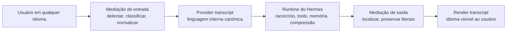

# unilang

**Runtime de mediação de linguagem orientado por pesquisa para o Hermes Agent**

Raciocínio interno canônico. Experiência nativa na linguagem do usuário.

Tratando sistemas multilíngues de agentes como um problema de runtime, não como truque de prompt.

[English](README.md)

---

## Visão Geral

`unilang` é a trilha de implementação do **LMR: Language Mediation Runtime**, uma camada de runtime projetada para o Hermes Agent.

Ela permite que o usuário converse com o Hermes em sua linguagem natural enquanto o runtime interno permanece alinhado em torno de uma **linguagem canônica de provider**.

Em vez de tratar tradução como gambiarra de prompt, como tool isolada ou como agente tradutor, o `unilang` trata interação multilíngue como uma **preocupação nativa do runtime**.

O projeto parte de uma ideia simples, mas importante:

> Uma experiência multilíngue para o usuário não exige um estado interno multilíngue.

Para um runtime de agentes, essas duas coisas precisam ser separadas.

## A Ideia Central

Cada interação importante pode existir em até três formas:

| Variante | Propósito | Exemplo |
|---|---|---|
| `raw` | Texto original para auditoria e replay | Mensagem do usuário em português |
| `provider` | Conteúdo interno canônico usado para raciocínio e turnos futuros | Transcript normalizado em inglês |
| `render` | Saída localizada mostrada ao usuário | Resposta do assistente em português |

Isso dá ao Hermes uma linguagem interna estável sem forçar a experiência humana a acontecer em inglês.

## Por Que Isso Existe

Chat multilíngue por si só não basta para um runtime de agentes sério.

Estado interno misturado em múltiplas línguas causa deriva em:

- consistência de raciocínio;
- escritas de memória;
- resumos de compressão;
- tarefas delegadas a agentes filhos;
- futuros fluxos de retrieval e knowledge.

O `unilang` foi desenhado para resolver isso separando **estado de transcript voltado para máquina** de **estado de saída voltado para humanos**.

## Por Que Política de Língua Importa

Já existe sinal suficiente na literatura para tratar escolha de idioma como variável de engenharia, e não como detalhe cosmético.

### 1. O idioma do prompt muda o comportamento do modelo

- Etxaniz et al. mostram que **auto-traduzir para inglês supera inferência direta em idiomas não ingleses** em cinco tarefas.[1]
- Kmainasi et al. relatam que em **197 experimentos em tarefas de árabe**, prompting em inglês teve o melhor resultado médio, seguido por prompting misto e depois prompting nativo.[2]
- Enomoto et al. mostram um quadro mais sutil: quando o viés de **translationese** é removido, a vantagem do inglês **existe, mas não é esmagadora**.[3]

O takeaway prático não é "inglês sempre vence". É que **o idioma do prompt altera o resultado**, e esse efeito depende da tarefa.

### 2. Estratégias de raciocínio cross-lingual podem melhorar desempenho

- Huang et al. mostram que o uso de cross-lingual-thought prompting pode **melhorar tarefas multilíngues e reduzir gaps entre idiomas**, incluindo **ganhos médios acima de 10 pontos** em raciocínio aritmético e open-domain QA no setup deles.[4]

Isso importa porque o `unilang` não é só sobre tradução. É sobre impor um caminho interno de raciocínio mais estável quando o runtime precisa de consistência.

### 3. Tokenização não é neutra entre idiomas

- Petrov et al. mostram que **o mesmo conteúdo pode gerar até 15x mais tokens** dependendo do idioma, com impacto direto em **custo, latência e contexto útil**.[5]
- Maksymenko e Turuta mostram que idiomas subrepresentados podem ficar **mais lentos e mais caros** por causa da tokenização, e que a eficiência também varia por domínio e morfologia.[6]

Para sistemas agentes, isso não é detalhe de billing. Isso mexe no budget de contexto, compressão, retrieval e tool use.

### 4. Capacidade multilíngue acompanha o desequilíbrio do treino

- O benchmark MEGA, com **70 idiomas**, destaca desafios persistentes em idiomas de baixo recurso.[7]
- Language Ranker mostra **forte correlação entre desempenho em um idioma e a proporção desse idioma no corpus de pretraining**.[8]

Ou seja: comportamento multilíngue em runtime herda assimetrias de dados, tokenização e treinamento.

## O Que o unilang Está Afirmando

O `unilang` **não** é construído sobre a tese de que inglês é universalmente superior.

Ele é construído sobre uma tese mais estreita e defensável:

1. a língua influencia a qualidade;
2. a língua influencia custo e latência;
3. estado interno multilíngue misturado cria instabilidade evitável;
4. um transcript interno canônico é uma forma testável de reduzir essa instabilidade.

## Hipótese de Trabalho

A hipótese operacional do `unilang` é:

| Dimensão | Hipótese |
|---|---|
| Qualidade de raciocínio | Uma linguagem interna canônica pode melhorar consistência em tarefas multilíngues com planejamento, tools ou estado longo |
| Custo | Um provider transcript estável pode reduzir expansão desnecessária de tokens e deriva multilíngue repetida |
| Memória | Variantes canônicas devem produzir escritas de memória menos ruidosas linguisticamente |
| Compressão | Resumos devem ficar melhores quando operam sobre uma política interna única, e não sobre histórico linguístico misturado |
| Delegação | Payloads para agentes filhos devem ficar mais limpos quando o protocolo interno é canonizado |
| UX | O usuário continua recebendo a resposta em seu idioma, com literais preservados |

Estamos tratando isso como **hipótese de runtime a ser medida**, não como slogan.

## O Que o unilang Está Construindo

- gerenciamento de transcript canônico para provider;
- entrega de transcript renderizado e localizado;
- normalização de entrada para novas mensagens do usuário;
- mediação seletiva de outputs textuais de tools;
- localização da resposta final após o loop principal;
- persistência de variantes para reuso e auditoria;
- roteamento de tradução com política de privacidade;
- compatibilidade com memória, compressão, delegação e gateways.

## O Que Conta Como Sucesso

O `unilang` só vale a pena se conseguir melhorar operação multilíngue sem corromper conteúdo literal nem quebrar invariantes do runtime.

Nos importamos com resultados como:

- melhor consistência de conclusão de tarefa entre idiomas do usuário;
- menor deriva multilíngue no estado interno do transcript;
- menor ou mais estável consumo de tokens por tarefa resolvida;
- melhor higiene de memória e compressão;
- forte preservação de código, logs, comandos, paths e payloads estruturados.

## Modelo de Runtime

## Por Que Uma Linguagem Canônica de Provider

Num chat comum, multilinguismo é majoritariamente um problema de apresentação.

Num runtime de agentes, ele também é um problema de sistema porque a escolha do idioma toca em:

- seleção e interpretação de tools;
- escritas de memória;
- compressão de contexto;
- resumos de retrieval;
- payloads de delegação;
- eficiência de token budget;
- auditoria e replay.

O `unilang` explicita tudo isso.

## Princípios Arquiteturais

1. Prefixos estáveis de prompt devem continuar estáveis.
2. Artefatos congelados de prompt devem ser normalizados uma vez, não retraduzidos a cada turno.
3. Artefatos literais precisam ser preservados.
4. O estado interno canônico deve ser a fonte autoritativa para uso de máquina.
5. A saída para humanos deve permanecer natural no idioma do usuário.
6. Fronteiras de privacidade não podem piorar com a introdução de tradução.

## Não Objetivos

O `unilang` não está tentando:

- provar que um idioma é sempre melhor para toda tarefa;
- substituir a capacidade multilíngue nativa dos foundation models;
- localizar todos os schemas de tools, CLIs e interfaces de provider já no primeiro dia;
- fazer interpretação simultânea perfeita token a token;
- trocar correção literal por fluidez.

## O Que Nunca Pode Ser Corrompido

Por design, o `unilang` preserva conteúdos literais como:

- blocos de código;
- comandos de shell;
- caminhos de arquivo;
- URLs;
- variáveis de ambiente;
- payloads estruturados como JSON, YAML e XML;
- stack traces e logs de terminal;
- identificadores, nomes de pacotes e argumentos de tools.

Se essa garantia falhar, o runtime falha.

## Áreas Planejadas do Sistema

| Área | Responsabilidade |
|---|---|
| `LanguageRuntime` | Orquestra decisões e fluxo de mediação |
| `LanguagePolicyEngine` | Controla thresholds, roteamento, privacidade e fallbacks |
| `LanguageDetector` | Detecta o idioma de origem com confiança |
| `ContentClassifier` | Separa prosa de código, logs e conteúdo estruturado |
| `TranslationAdapter` | Usa o runtime auxiliar do Hermes para transformações determinísticas |
| `VariantStore` | Persiste variantes `raw`, `provider` e `render` |
| `LanguageCache` | Reaproveita transformações por hash de conteúdo e política |

## Superfícies-Alvo de Integração com o Hermes

O `unilang` está sendo desenhado em torno dos seams reais do runtime do Hermes, especialmente:

- `run_agent.py`;
- montagem de prompt;
- persistência de sessão;
- memória e compressão;
- delegação;
- entrega por gateway;
- resolução de runtime provider.

A implementação é intencionalmente alinhada aos internals do Hermes, e não adicionada como uma tool externa.

## Plano de Medição

Como a tese central é empírica, o `unilang` deve ser avaliado pelo menos nestes eixos:

| Eixo | Pergunta exemplo |
|---|---|
| Qualidade de tarefa | Entrada em PT-BR com raciocínio interno EN supera ou empata com prompting direto em PT-BR? |
| Eficiência de tokens | Quantos tokens são economizados ou adicionados por normalização, localização e reuso de variantes? |
| Qualidade de compressão | Resumos ficam mais estáveis quando construídos sobre variantes de provider? |
| Qualidade de memória | Escritas de memória em linguagem canônica reduzem deriva e ambiguidade? |
| Qualidade de delegação | Child tasks passam a funcionar melhor com payloads canônicos? |
| Segurança literal | Comandos, paths, JSON, logs e código são preservados exatamente? |
| Latência | O overhead de mediação continua aceitável para uso conversacional? |

O projeto é, portanto, tanto uma implementação quanto um esforço de medição.

## Resumo do Roadmap

1. Estabelecer a base de integração com o host Hermes.
2. Entregar a mediação central de entrada e saída.
3. Adicionar persistência de variantes `provider` / `render` / `raw`.
4. Normalizar com segurança artefatos congelados de prompt.
5. Mediar seletivamente outputs textuais de tools.
6. Colocar compressão e memória sobre variantes canônicas do transcript.
7. Estender o modelo para delegação e gateways.
8. Endurecer, medir, documentar e preparar upstream.

## Status Atual

| Frente | Status |
|---|---|
| Repositório público | Ativo |
| Posicionamento do projeto | Definido |
| Mapeamento de integração com host | Em andamento |
| Implementação do runtime | Começando |
| Ambiente remoto isolado para validação | Pronto |

## Posicionamento

O `unilang` fica na interseção entre:

- pesquisa em prompting multilíngue;
- fairness e eficiência de tokenização;
- arquitetura de runtime para agentes;
- desenho de memória, compressão e delegação.

Não é só um wrapper multilíngue.

É uma tentativa de deixar sistemas agentes multilíngues **operacionalmente coerentes**.

## Fluxo de Desenvolvimento

O modelo de trabalho é intencionalmente dividido:

- o código é escrito localmente;
- o host Hermes é integrado em um checkout separado;
- execução isolada e debugging acontecem em um ambiente Docker remoto dedicado.

Isso mantém o repositório público limpo sem abrir mão de validação real contra o Hermes durante a implementação.

## Política do Repositório Público

Este repositório público exclui intencionalmente artefatos internos de planejamento e notas privadas de trabalho.

Isso significa que diretórios como `.planning/`, `docs/` internos e material de arquitetura local ficam fora do versionamento aqui. O repositório público é reservado para a superfície pública da implementação.

## Sinais de Pesquisa por Trás do Design

O desenho do `unilang` é informado por uma literatura crescente que aponta para a mesma direção por ângulos diferentes:

- idioma é variável de performance, não apenas camada de apresentação;[1][2][3]
- caminhos internos cross-lingual podem melhorar raciocínio;[4]
- assimetria de tokenização distorce custo, latência e contexto;[5][6]
- desempenho em idiomas de baixo recurso ainda é estruturalmente desigual.[7][8]

Isso não prova o `unilang` de antemão.

Mas prova que o problema é real o bastante para merecer um runtime próprio e uma avaliação rigorosa.

## Literatura Selecionada

1. [Etxaniz et al., 2024, NAACL: *Do Multilingual Language Models Think Better in English?*](https://aclanthology.org/2024.naacl-short.46/)  
   Self-translate supera inferência direta em cinco tarefas.

2. [Kmainasi et al., 2024: *Native vs Non-Native Language Prompting: A Comparative Analysis*](https://arxiv.org/abs/2409.07054)  
   Em 197 experimentos com tarefas em árabe, prompting em inglês teve o melhor desempenho médio.

3. [Enomoto et al., 2025, NAACL: *A Fair Comparison without Translationese: English vs. Target-language Instructions for Multilingual LLMs*](https://aclanthology.org/2025.naacl-short.55/)  
   Efeito de idioma existe, mas a vantagem do inglês não é esmagadora quando o viés de translationese é controlado.

4. [Huang et al., 2023, EMNLP Findings: *Not All Languages Are Created Equal in LLMs*](https://aclanthology.org/2023.findings-emnlp.826/)  
   Cross-lingual-thought prompting melhora raciocínio multilíngue e reduz gaps entre idiomas.

5. [Petrov et al., 2023, NeurIPS: *Language Model Tokenizers Introduce Unfairness Between Languages*](https://arxiv.org/abs/2305.15425)  
   O mesmo conteúdo pode tokenizar de forma radicalmente desigual entre idiomas, com efeito direto em custo, latência e contexto útil.

6. [Maksymenko and Turuta, 2025, Frontiers: *Tokenization Efficiency of Current Foundational Large Language Models for the Ukrainian Language*](https://www.frontiersin.org/journals/artificial-intelligence/articles/10.3389/frai.2025.1538165/full)  
   Idiomas subrepresentados podem ficar materialmente mais lentos e caros, e a eficiência de tokenização varia por domínio e morfologia.

7. [Ahuja et al., 2023, EMNLP: *MEGA: Multilingual Evaluation of Generative AI*](https://arxiv.org/abs/2303.12528)  
   Grande avaliação multilíngue mostrando desafios persistentes em idiomas de baixo recurso.

8. [Li et al., 2024/2025, AAAI: *Language Ranker*](https://arxiv.org/abs/2404.11553)  
   Mostra forte correlação entre desempenho por idioma e participação desse idioma no corpus de pretraining.

9. [Ghosh et al., 2025, EMNLP Findings: *A Survey of Multilingual Reasoning in Language Models*](https://arxiv.org/abs/2502.09457)  
   Bom panorama sobre desafios, métodos e lacunas em raciocínio multilíngue.

## Direção do Projeto

Este é um repositório em construção ativa, não um conceito abandonado.

O estágio atual é transformar essa arquitetura orientada por pesquisa em uma trilha pública limpa de implementação e então conectá-la ao Hermes de modo que preserve estabilidade de cache, garantias de privacidade, correção literal e observabilidade do runtime.

---

## Resumo

O `unilang` está construindo um modelo sério de runtime multilíngue para o Hermes Agent.

Não é retradução do histórico inteiro. Não é uma tool de tradução. Não é um truque superficial de prompt.

É um transcript interno canônico, um transcript humano localizado e um runtime desenhado para manter os dois limpos.

A aposta não é que idioma deixa de importar.

A aposta é que, quando política de idioma vira algo explícito, mensurável e nativo do runtime, sistemas agentes multilíngues ficam mais estáveis, auditáveis e eficientes de operar.
