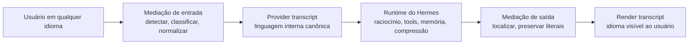

# unilang

**Infraestrutura de mediação de linguagem para o Hermes Agent**

Raciocínio interno canônico. Experiência nativa na linguagem do usuário.

[English](README.md)

---

## Visão Geral

`unilang` é a trilha de implementação do **LMR: Language Mediation Runtime**, uma camada de runtime projetada para o Hermes Agent.

Ela permite que o usuário converse com o Hermes em sua linguagem natural enquanto o runtime interno permanece alinhado em torno de uma **linguagem canônica de provider**.

Em vez de tratar tradução como gambiarra de prompt ou como um agente auxiliar, o `unilang` trata interação multilíngue como uma preocupação nativa do runtime.

## A Ideia Central

Cada interação importante pode existir em até três formas:

| Variante | Propósito | Exemplo |
|---|---|---|
| `raw` | Texto original para auditoria e replay | Mensagem do usuário em português |
| `provider` | Conteúdo interno canônico usado para raciocínio e turnos futuros | Transcript normalizado em inglês |
| `render` | Saída localizada mostrada ao usuário | Resposta do assistente em português |

Isso dá ao Hermes uma linguagem interna estável sem forçar a experiência humana a acontecer em inglês.

## Por Que Isso Existe

Chat multilíngue por si só não basta para um runtime de agentes sério.

Estado interno misturado em múltiplas línguas causa deriva em:

- consistência de raciocínio;
- escritas de memória;
- resumos de compressão;
- tarefas delegadas a agentes filhos;
- futuros fluxos de retrieval e knowledge.

O `unilang` foi desenhado para resolver isso separando **estado de transcript voltado para máquina** de **estado de saída voltado para humanos**.

## O Que o unilang Está Construindo

- gerenciamento de transcript canônico para provider;
- entrega de transcript renderizado e localizado;
- normalização de entrada para novas mensagens do usuário;
- mediação seletiva de outputs textuais de tools;
- localização da resposta final após o loop principal;
- persistência de variantes para reuso e auditoria;
- roteamento de tradução com política de privacidade;
- compatibilidade com memória, compressão, delegação e gateways.

## Modelo de Runtime

## Princípios Arquiteturais

1. Prefixos estáveis de prompt devem continuar estáveis.
2. Artefatos congelados de prompt devem ser normalizados uma vez, não retraduzidos a cada turno.
3. Artefatos literais precisam ser preservados.
4. O estado interno canônico deve ser a fonte autoritativa para uso de máquina.
5. A saída para humanos deve permanecer natural no idioma do usuário.
6. Fronteiras de privacidade não podem piorar com a introdução de tradução.

## O Que Nunca Pode Ser Corrompido

Por design, o `unilang` preserva conteúdos literais como:

- blocos de código;
- comandos de shell;
- caminhos de arquivo;
- URLs;
- variáveis de ambiente;
- payloads estruturados como JSON, YAML e XML;
- stack traces e logs de terminal;
- identificadores, nomes de pacotes e argumentos de tools.

## Áreas Planejadas do Sistema

| Área | Responsabilidade |
|---|---|
| `LanguageRuntime` | Orquestra decisões e fluxo de mediação |
| `LanguagePolicyEngine` | Controla thresholds, roteamento, privacidade e fallbacks |
| `LanguageDetector` | Detecta o idioma de origem com confiança |
| `ContentClassifier` | Separa prosa de código, logs e conteúdo estruturado |
| `TranslationAdapter` | Usa o runtime auxiliar do Hermes para transformações determinísticas |
| `VariantStore` | Persiste variantes `raw`, `provider` e `render` |
| `LanguageCache` | Reaproveita transformações por hash de conteúdo e política |

## Superfícies-Alvo de Integração com o Hermes

O `unilang` está sendo desenhado em torno dos seams reais do runtime do Hermes, especialmente:

- `run_agent.py`;
- montagem de prompt;
- persistência de sessão;
- memória e compressão;
- delegação;
- entrega por gateway;
- resolução de runtime provider.

A implementação é intencionalmente alinhada aos internals do Hermes, e não adicionada como uma tool externa.

## Resumo do Roadmap

1. Estabelecer a base de integração com o host Hermes.
2. Entregar a mediação central de entrada e saída.
3. Adicionar persistência de variantes `provider` / `render` / `raw`.
4. Normalizar com segurança artefatos congelados de prompt.
5. Mediar seletivamente outputs textuais de tools.
6. Colocar compressão e memória sobre variantes canônicas do transcript.
7. Estender o modelo para delegação e gateways.
8. Endurecer, medir, documentar e preparar upstream.

## Status Atual

| Frente | Status |
|---|---|
| Repositório público | Ativo |
| Posicionamento do projeto | Definido |
| Mapeamento de integração com host | Em andamento |
| Implementação do runtime | Começando |
| Ambiente remoto isolado para validação | Pronto |

## Fluxo de Desenvolvimento

O modelo de trabalho é intencionalmente dividido:

- o código é escrito localmente;
- o host Hermes é integrado em um checkout separado;
- execução isolada e debugging acontecem em um ambiente Docker remoto dedicado.

Isso mantém o repositório público limpo sem abrir mão de validação real contra o Hermes durante a implementação.

## Política do Repositório Público

Este repositório público exclui intencionalmente artefatos internos de planejamento e notas privadas de trabalho.

Isso significa que diretórios como `.planning/`, `docs/` internos e material de arquitetura local ficam fora do versionamento aqui. O repositório público é reservado para a superfície pública da implementação.

## Direção do Projeto

Este é um repositório em construção ativa, não um conceito abandonado.

O estágio atual é transformar a arquitetura em uma trilha pública de implementação limpa e então conectar o runtime ao Hermes de forma que preserve estabilidade de cache, garantias de privacidade e correção de conteúdo literal.

---

## Resumo

O `unilang` está construindo um modelo sério de runtime multilíngue para o Hermes Agent.

Não é retradução do histórico inteiro. Não é uma tool de tradução. Não é um truque superficial de prompt.

É um transcript interno canônico, um transcript humano localizado e um runtime desenhado para manter os dois limpos.
