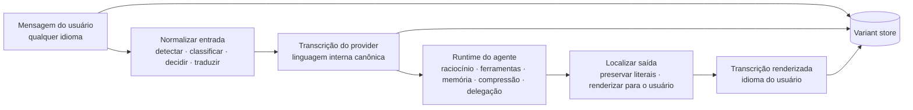

<div align="center">

# unilang

[English](README.md) · **Português (Brasil)**

**Linguagem interna canônica. UX multilíngue nativa.**

Primitivos de runtime para mediação de linguagem em sistemas de agentes multilíngues, desenhados em torno de uma regra simples:

**humanos falam naturalmente, o runtime continua coerente.**

[](#instalação)
[](#status-atual)
[](#integração-com-o-hermes)
[](#arquitetura)
[](#invariantes-de-segurança)

```text
raw -> provider -> agent runtime -> render
```

[Visão Geral](#visão-geral) · [Status Atual](#status-atual) · [Arquitetura](#arquitetura) · [Benchmarks](#benchmarks) · [Instalação](#instalação) · [Integração com o Hermes](#integração-com-o-hermes)

</div>

---

## Visão Geral

`unilang` é uma **language mediation runtime**.

Ele permite que uma pessoa interaja na própria língua enquanto o runtime do agente mantém uma **transcrição em linguagem canônica do provider** para chamadas de modelo, sumários, memória, delegação e fluxos pesados com ferramentas.

Isso não é um truque de prompt e nem uma camada genérica de “traduzir tudo”. É uma política de runtime que separa três preocupações:

| Variante | Papel |
|---|---|
| `raw` | texto original do usuário preservado exatamente |
| `provider` | texto canônico machine-facing usado internamente |
| `render` | saída localizada e human-facing |

Essa separação dá ao sistema três propriedades ao mesmo tempo:

- UX multilíngue nativa;
- estado machine-facing estável;
- proveniência auditável para replay e debug.

---

## Por Que Ele Existe

Multilinguismo é fácil na superfície do chat e difícil no runtime.

Quando um agente começa a acumular estado, linguagem vira infraestrutura:

- escritas de memória sofrem drift;
- sumários ficam inconsistentes;
- tarefas delegadas ficam mais ruidosas;
- semântica de recuperação fragmenta;
- código e literais críticos para máquina correm risco de serem corrompidos.

`unilang` existe para tornar a política de linguagem explícita, testável e reaproveitável ao longo dessas fronteiras.

---

## Status Atual

`unilang` hoje é um **protótipo ativo com primitivas de runtime funcionais e integração do lado do Hermes**.

O que já está implementado:

- orquestração em `LanguageRuntime` para normalização de entrada, localização de saída, mediação de resultados de ferramenta, artefatos de prompt, compressão, memória, delegação e entrega por gateway;
- `LanguageCache` com SQLite para reaproveitamento de transformações;
- `VariantStore` com SQLite para persistência de `raw` / `provider` / `render`;
- `PassthroughTranslationAdapter` para testes locais determinísticos;
- `MiniMaxTranslationAdapter` para tradução real via API Anthropic-compatible da MiniMax;
- integração do lado do Hermes via `UnilangMediator` dentro do agent loop;
- cobertura de regressão para comportamento do runtime e integração do mediator.

O que ainda está em nível de protótipo:

- a detecção de idioma é heurística, não um serviço completo de language ID;
- a qualidade da tradução ao vivo depende do modelo externo configurado;
- localização em streaming não está implementada;
- este repositório é centrado na camada de runtime, não em uma superfície final polida para usuário final.

---

## Superfície Testada

A superfície atualmente testada inclui:

- normalização de turno do usuário;
- localização da saída do assistente;
- preservação literal de code fences e literais inline;
- mediação seletiva de resultados de ferramenta;
- reaproveitamento de cache e comportamento de versão de cache;
- preparação de artefatos de prompt e comportamento de freeze-once;
- formatação de payloads de compressão e memória;
- formatação de payloads de delegação e herança de contexto filho;
- preparação de mensagens de gateway;
- wiring do mediator no Hermes e uso amarrado à sessão.

Status atual de regressão local:

```text
unilang tests: 69 passed
hermes-agent unilang mediator tests: 3 passed
```

---

## Benchmarks

Hoje existem duas trilhas de benchmark.

### 1. Benchmark determinístico local do runtime

Arquivo:

- `benchmark_runtime.py`

Objetivo:

- medir overhead do runtime sem variância de rede;
- comparar caminhos cold vs warm;
- validar o comportamento do cache.

O que ele cobre:

- `normalize_user_message()`
- `localize_assistant_output()`
- `prepare_prompt_artifacts()`
- `mediate_tool_result()`

Snapshot local já documentado em `docs/BENCHMARKS.md`:

- o warm path de prompt artifacts cai para cerca de `2 ms`;
- cache hits aparecem e store failures são `0`;
- mediação de tool result é o caminho determinístico mais caro, como esperado.

### 2. Benchmark live end-to-end com MiniMax

Arquivos:

- `scripts/benchmarks/benchmark_quick.py`
- `scripts/benchmarks/benchmark_e2e_minimax.py`
- `scripts/benchmarks/benchmark_e2e_minimax_controlled.py`

O benchmark controlado de 18 idiomas foi executado na VPS com MiniMax e produziu:

```text
Detection:    18/18
Normalization: 17/18
Localization:  17/18
Tool Med:      18/18
```

Comportamento live observado:

- a detecção cobriu todos os idiomas do benchmark controlado;
- normalização e localização funcionaram para todos os casos não ingleses, exceto o no-op esperado do inglês;
- mediação de ferramenta preservou conteúdo crítico para máquina e ficou praticamente irrelevante diante da latência da tradução live;
- a latência de tradução variou por idioma e condição de rede, indo de poucos segundos até cerca de `11.5 s` em algumas localizações.

Resultados representativos da execução controlada na VPS:

```text
Spanish:    det=Y(es)  norm=Y 5753ms  loc=Y 2927ms  tool=Y 17ms
Portuguese: det=Y(pt-BR) norm=Y 1898ms loc=Y 6967ms tool=Y 14ms
German:     det=Y(de)  norm=Y 1695ms  loc=Y 11555ms tool=Y 8ms
Japanese:   det=Y(ja)  norm=Y 2443ms  loc=Y 11018ms tool=Y 7ms
Hebrew:     det=Y(he)  norm=Y 2310ms  loc=Y 7513ms tool=Y 8ms
```

---

## Arquitetura

Em alto nível, `unilang` insere uma camada de mediação em volta do runtime do agente.



### Componentes centrais do runtime

| Componente | Responsabilidade |
|---|---|
| `LanguageRuntime` | orquestração de todos os caminhos de mediação |
| `LanguageDetector` | detecção heurística de idioma por mensagem |
| `ContentClassifier` | distingue prosa, código, terminal, estruturado e misto |
| `LanguagePolicyEngine` | decide se e como transformar |
| `BaseTranslationAdapter` | contrato de tradução/localização |
| `PassthroughTranslationAdapter` | adapter determinístico sem transformação para testes |
| `MiniMaxTranslationAdapter` | adapter de tradução real via MiniMax |
| `LanguageCache` | cache de transformações por conteúdo e metadados de política/modelo |
| `VariantStore` | persistência das variantes `raw`, `provider` e `render` |
| `PromptArtifactScanner` | gate/scanner de artefatos de prompt antes da preparação |

### Fluxo do runtime

#### Normalização de entrada

`normalize_user_message()`:

1. detecta o idioma da entrada;
2. classifica o tipo de conteúdo;
3. decide se normalização é necessária;
4. traduz apenas quando a política exige;
5. armazena variantes `raw` e `provider`.

#### Localização de saída

`localize_assistant_output()`:

1. classifica o texto do provider;
2. resolve o idioma de render a partir do estado da sessão;
3. localiza apenas quando o idioma de render difere do idioma do provider;
4. armazena variantes `provider` e `render`.

#### Mediação de resultados de ferramenta

`mediate_tool_result()` executa mediação segment-aware, transformando apenas as partes em linguagem natural.

---

## Invariantes de Segurança

> [!IMPORTANT]
> Se `unilang` mutar literais críticos para máquina, o runtime falhou.

O runtime foi desenhado para preservar:

- blocos de código cercados por fences;
- spans de código inline;
- comandos shell e flags;
- file paths;
- URLs;
- variáveis de ambiente e placeholders;
- payloads estruturados como JSON / YAML / XML;
- stack traces e logs de terminal;
- identificadores, símbolos e nomes de pacote.

Fluência é útil. Integridade literal é obrigatória.

---

## Integração com o Hermes

`unilang` é integrado ao Hermes por meio de `agent/unilang_mediator.py`.

Os pontos atuais de integração são:

1. **entrada do turno**: normalizar a mensagem do usuário antes de ela entrar no loop principal;
2. **resultado de ferramenta**: mediar a saída da ferramenta antes de reinseri-la na transcrição;
3. **saída final**: localizar a resposta do assistente antes de retorná-la ao usuário;
4. **binding de sessão**: manter o estado de mediação amarrado à sessão ativa do Hermes.

O mediator é safe by default:

- quando `language_mediation.enabled = false`, todos os métodos viram pass-through;
- workflows já existentes em inglês continuam inalterados;
- MiniMax pode ser habilitado sem mudar o contrato do runtime.

---

## Instalação

### Pacote base

```bash
pip install -e .
```

### Com suporte a MiniMax

```bash
pip install -e ".[minimax]"
```

### Dependências de teste

```bash
pip install -e ".[dev]"
```

---

## Configuração

A configuração mínima do runtime gira em torno de:

- `enabled`
- `provider_language`
- seleção de translator/adapter
- política de saída
- cache / variant store opcionais

Exemplo de arquivo de ambiente:

```env
MINIMAX_API_KEY=your-minimax-api-key-here
```

Defaults principais de `src/unilang/config.py`:

| Chave | Default |
|---|---|
| `enabled` | `False` |
| `provider_language` | `en` |
| `render_language` | `auto` |
| `turn_input.normalize_user_messages` | `True` |
| `output.localize_assistant_messages` | `True` |
| `output.preserve_literals` | `True` |
| `tool_results.enabled` | `False` |
| `compression.enabled` | `False` |
| `memory.enabled` | `False` |

---

## Layout do Repositório

```text
src/unilang/                 código-fonte do pacote
tests/                       testes automatizados de regressão
scripts/benchmarks/          runners de benchmark live e determinísticos
scripts/dev/                 helpers de inspeção
scripts/smoke/               scripts manuais de smoke/integration check
docs/                        notas de arquitetura, operação e benchmark
benchmark_runtime.py         harness determinístico principal
benchmark_e2e_multilingual.py benchmark base multilíngue usando passthrough adapter
```

---

## Base de Design

Este projeto foi construído em cima de três fontes de evidência.

### 1. Análise de arquitetura de runtime

O design foi moldado em torno de seams reais de agentes, especialmente:

- montagem de prompt;
- persistência de mensagens;
- compressão de contexto;
- escritas de memória;
- payloads de delegação;
- saída voltada a gateway.

### 2. Restrições multilíngues orientadas a sistema

O projeto trata multilinguismo como um **problema de gerenciamento de estado**, não apenas de formatação de saída.

Esse enquadramento guia:

- o design da transcrição canônica do provider;
- a persistência sidecar de variantes;
- chaves de cache atreladas a política e metadados de modelo;
- mediação segment-aware para resultados de ferramenta;
- invariantes estritos de preservação literal.

### 3. Experimentos de runtime e benchmarks

A implementação foi moldada contra:

- benchmarks determinísticos do runtime local;
- execuções de tradução live com MiniMax;
- execução de benchmark multilíngue end-to-end em VPS;
- smoke tests do mediator do lado do Hermes.

---

## Documentação

Documentos de apoio em `docs/`:

- `ARCHITECTURE.md`
- `BENCHMARKS.md`
- `OPERATOR-GUIDE.md`
- `REMOTE-TESTING.md`
- `IMPLEMENTATION-STRATEGY.md`
- `MIGRATION.md`
- `ACCEPTANCE-CHECKLIST.md`
- `RELEASE-NOTES.md`

---

## Limitações

As limitações atuais são explícitas:

- o detector é heurístico e orientado ao benchmark, não um serviço geral de language ID;
- a latência live de tradução é dominada por custo de rede/modelo externo;
- mediação de retrieval e localização em streaming não estão implementadas;
- o README em português pode ocasionalmente atrasar em relação ao inglês em momentos de iteração rápida.

---

## Resumo

`unilang` é uma camada prática de runtime para sistemas de agentes multilíngues.

Ela já é útil porque resolve corretamente a parte difícil:

- **manter o estado machine-facing coerente**;
- **manter a experiência humana nativa**;
- **nunca corromper literais**.

Essa é a promessa central de sistema do projeto.
