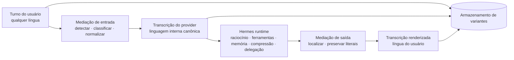

<div align="center">

# unilang

[English](README.md) · **Português (Brasil)**

**Linguagem interna canônica. UX multilíngue nativa.**

**Uma language mediation runtime para o Hermes Agent que trata multilingualidade como problema de sistema — não como truque de prompt.**

[](#status-atual)
[](#como-se-encaixa-no-hermes)
[](#o-modelo-de-runtime)
[](#objetivos-de-design)
[](#o-que-o-usu%C3%A1rio-experiencia)
[](#o-que-nunca-pode-ser-corrompido)

<br>

```text
raw → provider → Hermes runtime → render
```

**O usuário deve falar naturalmente.**  
**O runtime deve continuar linguisticamente coerente.**

<br>

> *Uma experiência multilíngue para o usuário não exige um estado interno multilíngue.*

<br>

[Por que isso existe](#por-que-isso-existe) · [Modelo de runtime](#o-modelo-de-runtime) · [Como se encaixa no Hermes](#como-se-encaixa-no-hermes) · [Status atual](#status-atual) · [Roadmap](#roadmap-de-implementação)

</div>

---

> [!IMPORTANT]
> `unilang` **não** é “traduzir tudo para inglês e torcer para dar certo”.
>
> É uma trilha de design e implementação de uma **language mediation runtime**: uma camada de runtime que permite ao usuário falar com o Hermes em sua língua nativa enquanto o agente mantém uma **política interna canônica de linguagem** para raciocínio, sumários, memória, delegação e execução pesada com ferramentas.

---

## Por que isso existe

A maioria dos produtos de IA multilíngues para na fluência de superfície.

Isso basta para um chatbot. **Não** basta para um runtime de agentes.

O Hermes não está apenas gerando respostas. Ele monta prompts, resolve providers, persiste sessões, comprime contexto, entrega por gateways e executa workflows com ferramentas sobre estado de longa duração. Esses são limites arquiteturais reais explicitados na documentação oficial do Hermes. citeturn422277search2turn422277search1turn422277search0turn422277search6turn422277search7turn422277search5

Quando um agente acumula estado, **linguagem vira infraestrutura**.

Se cada turno do usuário, escrita de memória, payload delegado, sumário comprimido e resultado de ferramenta deriva entre línguas diferentes, o runtime herda instabilidades evitáveis:

- drift de memória;
- recuperação semântica mais fraca;
- sumários inconsistentes;
- tarefas delegadas mais ruidosas;
- expansão desnecessária de tokens;
- corrupção literal em torno de código, logs, flags, paths e payloads estruturados.

`unilang` existe para tornar a política de linguagem **explícita, testável, inspecionável e nativa ao runtime**.

---

## A tese

Um agente sério deve separar:

1. **a língua que o humano prefere usar**, de
2. **a língua que o runtime prefere preservar internamente**.

Essa separação cria um modelo operacional simples e poderoso:

- pessoas interagem na própria língua;
- o runtime raciocina sobre uma transcrição canônica voltada ao provider;
- a mensagem original continua disponível para auditoria e recuperação literal;
- as saídas são renderizadas de volta na língua do usuário sem contaminar o estado interno.

Este repo explora esse modelo de ponta a ponta para o Hermes.

---

## O modelo de runtime

Cada turno importante pode existir em até três variantes:

| Variante | Função | Exemplo |
|---|---|---|
| `raw` | texto original preservado exatamente | `me explica esse erro e arruma meu docker compose` |
| `provider` | forma canônica machine-facing usada pelo runtime | `Explain this error and fix my docker compose setup.` |
| `render` | resposta localizada apresentada ao usuário | `Claro — vou te explicar o erro e ajustar seu docker-compose.` |

Isso dá ao sistema três coisas ao mesmo tempo:

- UX nativa;
- estado interno coerente;
- proveniência reaproveitável.



---

## O que o usuário experiencia

Do lado do usuário, `unilang` deve parecer quase invisível.

O usuário recebe:

- entrada natural em português, japonês, árabe, espanhol, mistura de línguas ou o que realmente usar;
- saída natural na mesma língua;
- proteção contra “translationese” em conteúdo técnico;
- preservação de código, stack traces, configs, JSON, comandos e file paths;
- comportamento mais consistente em sessões longas.

O ponto **não** é fazer o usuário se adaptar ao runtime.

O ponto é permitir que o runtime se adapte sem virar caos linguístico.

---

## O que nunca pode ser corrompido

> [!CAUTION]
> Se `unilang` mutar literais críticos para máquina, o runtime falhou.

Estas classes de conteúdo precisam ser preservadas exatamente quando a política exigir:

- code fences e blocos de código;
- comandos shell e flags de CLI;
- file paths e URLs;
- variáveis de ambiente e placeholders de segredo;
- JSON, YAML, XML, SQL, regex e fragmentos de configuração;
- stack traces, logs e saída de terminal;
- nomes de pacote, símbolos, identificadores e funções;
- diff hunks e payloads estruturados de ferramentas.

Fluência é opcional. Integridade literal não é.

---

## Objetivos de design

### 1. Estado interno canônico
O runtime deve ter uma política linguística estável para raciocínio, memória, compressão, delegação e representações voltadas à recuperação.

### 2. Saída nativa para humanos
O usuário continua recebendo respostas na própria língua, de forma natural.

### 3. Segurança literal
Texto crítico para máquina atravessa a mediação intacto.

### 4. Mediação seletiva
Nem todo byte deve ser traduzido. A política precisa ser consciente do conteúdo.

### 5. Persistência de variantes
`raw`, `provider` e `render` devem poder ser reaproveitados para auditoria, replay, cache e avaliação futura.

### 6. Observabilidade
A mediação linguística deve ser mensurável, debugável e benchmarkável.

### 7. Realismo de upstream
Isso precisa encaixar no Hermes como ele existe hoje, não num sistema imaginário greenfield.

---

## Como se encaixa no Hermes

`unilang` está sendo moldado contra seams arquiteturais reais do Hermes.

A documentação oficial do Hermes explicita prompt assembly, provider runtime resolution, session storage, context compression, gateway internals e agent-loop internals como superfícies centrais de implementação. É exatamente aí que política de linguagem mais importa. citeturn422277search2turn422277search1turn422277search0turn422277search4turn422277search5turn422277search6turn422277search7

| Superfície do Hermes | Por que importa para `unilang` |
|---|---|
| Prompt assembly | a transcrição canônica do provider precisa preservar estabilidade e cacheabilidade do prompt |
| Provider runtime resolution | a política de mediação precisa coexistir com seleção de provider e modo de API |
| Agent loop | o ciclo de turno é o ponto natural de interceptação para mediação de entrada e saída |
| Session storage | persistência de variantes e replay dependem de onde o estado da transcrição vive |
| Context compression | sumários em linguagem canônica ficam mais coerentes e comparáveis |
| Gateway internals | localização deve acontecer nas bordas de entrega sem contaminar o estado interno |
| Delegação | tarefas-filhas devem herdar payloads machine-facing estáveis |
| Pipeline de memória | escritas canônicas de memória podem reduzir drift multilíngue |

---

## O que este repo é

Hoje, este repo se lê como uma **trilha séria de design e integração** mais do que como um runtime empacotado e acabado.

Isso é força, não fraqueza.

Significa que o projeto já está organizado em torno de fases de implementação, não de ideias vagas.

### Estrutura atual do repo

| Área | Papel |
|---|---|
| `.planning/research/` | notas de arquitetura, verificação do host, estratégia de integração |
| `.planning/phases/` | documentação das fases de implementação |
| `.planning/plans/` | planejamento de execução da integração com o host |

### Mapa atual de fases

| Fase | Foco |
|---|---|
| 00 | Integração com o host |
| 01 | Core runtime |
| 02 | Variantes e armazenamento |
| 03 | Artefatos de prompt |
| 04 | Resultados de ferramentas |
| 05 | Memória e compressão |
| 06 | Delegação e gateways |
| 07 | Polimento e upstreaming |

Esse é o formato certo para um projeto cujo problema mais difícil é correção arquitetural.

---

## Status atual

> [!NOTE]
> `unilang` hoje deve ser lido como uma **trilha de implementação de alta convicção, apoiada em seams reais do Hermes**.
>
> O projeto já está estruturado como um sistema que pretende nascer para upstream — mas o README deve refletir isso com honestidade, sem fingir que já é um produto turnkey.

Então o enquadramento correto é:

- não “hack experimental de prompt”;  
- não “plugin tradutor universal”;  
- não “SDK finalizado com instalação polida”;  
- mas **uma trilha de arquitetura de runtime com qualidade de upstream e fronteiras claras de implementação**.

---

## Por que essa abordagem é forte

Porque ela ataca o modo de falha real.

A maioria das configurações multilíngues para agentes trata linguagem como preocupação de superfície.

`unilang` trata linguagem como **problema de gerenciamento de estado**.

Isso muda tudo:

- sumários ficam comparáveis entre sessões;
- memória fica menos fragmentada por língua;
- tarefas delegadas herdam payloads mais limpos;
- raciocínio voltado ao provider permanece coerente;
- a língua do usuário continua nativa;
- avaliação passa a ser possível na camada de política de runtime.

Essa é a diferença entre “o modelo fala várias línguas” e “o sistema tem uma arquitetura de linguagem”.

---

## Não-objetivos

`unilang` **não** está tentando ser:

- um tradutor genérico de chatbot;
- um pipeline cego de “tudo para inglês”; 
- um substituto para capacidade multilíngue nativa do modelo;
- uma máquina para reescrever o histórico inteiro sem necessidade;
- uma camada que sacrifica correção literal por suavidade estilística;
- uma tese de que uma língua é universalmente superior em qualquer contexto.

Isso é sobre **disciplina de runtime**, não ideologia linguística.

---

## Roadmap de implementação

### Fase 00 — Integração com o host
Encontrar os seams certos de interceptação dentro do Hermes.

### Fase 01 — Core runtime
Estabelecer o contrato de mediação e o fluxo canônico.

### Fase 02 — Variantes e armazenamento
Persistir `raw`, `provider` e `render` de forma limpa.

### Fase 03 — Artefatos de prompt
Proteger estabilidade, cacheabilidade e montagem canônica do prompt.

### Fase 04 — Resultados de ferramentas
Introduzir mediação seletiva para saídas tool-heavy sem corromper literais.

### Fase 05 — Memória e compressão
Tornar sumários e escritas de memória canônicos, inspecionáveis e avaliáveis.

### Fase 06 — Delegação e gateways
Empurrar a política para tarefas-filhas e superfícies de entrega por gateway.

### Fase 07 — Polimento e upstreaming
Endurecer, documentar, benchmarkar e preparar o trabalho para discussão séria de upstream.

---

## Critérios de sucesso

`unilang` é bem-sucedido se conseguir demonstrar, em fluxos reais do Hermes, que:

- o usuário mantém interação nativa na própria língua;
- o estado voltado ao provider permanece estável e coerente;
- artefatos literais são preservados corretamente;
- memória e compressão melhoram ou ficam mais consistentes;
- delegação herda payloads mais limpos;
- o sistema continua observável o bastante para depurar falhas em vez de adivinhar.

Se essas condições não forem satisfeitas, o projeto é decoração, não arquitetura.

---

## O que um grande README futuro pode adicionar

Quando a implementação amadurecer, este README pode crescer para incluir:

- instruções concretas de instalação;
- diagramas de arquitetura ligados a code paths reais;
- resultados de benchmark;
- exemplos antes/depois de compressão e qualidade de memória;
- suites de teste para preservação literal;
- exemplos de integração com seams vivos do Hermes;
- um caminho claro de contribuição para upstream.

Esse README futuro deve parecer inevitável.

Este aqui foi desenhado para fazer o projeto parecer **sério o bastante para merecê-lo**.

---

## Uma linha final

<div align="center">

**UX multilíngue é fácil de demonstrar.**  
**Coerência multilíngue de runtime é o problema real.**

**`unilang` existe para o segundo.**

</div>
